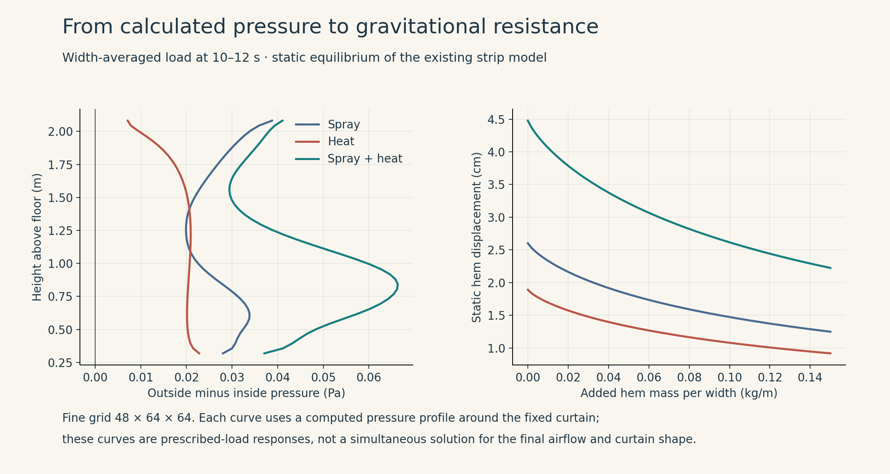
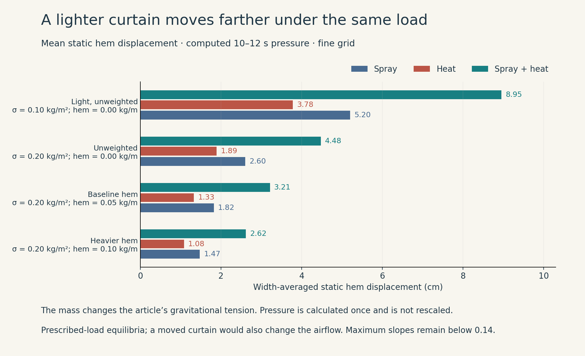
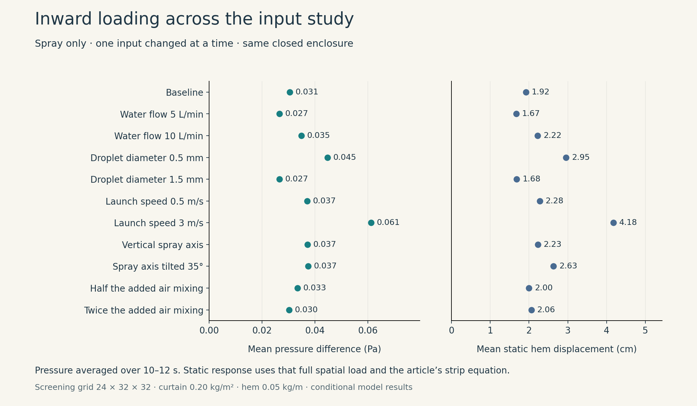
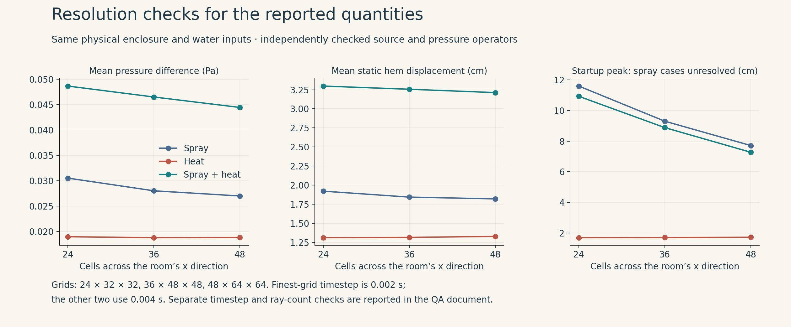

# Shower curtain: numerical results

**The connected model produces inward loading from spray, from heating, and from both together.** With the declared inputs, the calculated pressure gives centimetre-scale static deflections. A lighter, unweighted curtain moves farther under the same load. These results support the article's intended plausibility demonstration without fitting measurements or supplying a desired pressure difference.

This companion report records the numerical study used in the revised article. It preserves the detailed acceptance comparisons, including measures excluded from the article's main quantitative argument.

## What was calculated

The calculation follows the article's physical sequence:

| Earlier explanation | Implemented continuation |
| --- | --- |
| Droplet drag transfers momentum to air | Lagrangian water parcels with Schiller–Naumann drag; equal and opposite gas forcing |
| Warm water heats air, allowing buoyancy | Ranz–Marshall sensible heat exchange; computed gas temperature enters the Boussinesq momentum equation |
| Air circulation establishes pressure | Three-dimensional incompressible flow around an impermeable curtain, with openings above and below |
| Pressure moves a suspended sheet | The calculated outside-minus-inside pressure drives the article's gravitationally tensioned strip equation |
| Hem weights resist inward movement | The same tension law, with the hem mass changed while the calculated load is held fixed |

The initial enclosure is still and isothermal. The simulation covers 0–12 seconds. The baseline uses 8 L/min of water, 1 mm representative droplets, 1 m/s launch speed, and a 20° spray-axis tilt. Heated cases inject water at 40°C into air initially at 22°C. The air temperature is calculated from heat transfer; it is not assigned the water's temperature rise. [MODEL.md](docs/MODEL.md) gives every equation, boundary condition, parameter and evidence source.

The room is 1.8 × 2.4 × 2.4 m. A 1.8 m tall flat curtain divides it, with 0.3 m gaps above and below and sealed vertical ends. The model uses free tangential slip, insulated walls and declared effective mixing coefficients. It contains no bather, ventilation, evaporation, splash or wet-contact model. These choices describe a specific simplified enclosure.

Momentum-only and heat-only cases are computational controls: one gas exchange is suppressed to isolate the other mechanism. They are not independently realizable shower devices. The control with both gas exchanges disabled remains exactly at rest.

## Pressure and static displacement

The primary mechanical result uses the **spatially resolved pressure averaged over 10–12 seconds**. This is a selected transient window, not an established steady state. Time averaging uses the trapezoidal integral of the stored signal; no pressure multiplier or fitted offset is applied.

The baseline strip has mass per area 0.20 kg/m² and hem mass 0.05 kg per metre of width. The table reports the finest grid, 48 × 64 × 64 cells.

The reported mechanics uses pressure alone, matching the article's leading-load approximation. A separate calculation on the screening grid adds the modeled normal viscous stress; it increases width-averaged static hem displacement by about 2.0% for spray, 3.5% for heating and 3.0% for both. This is a sensitivity check at that resolution. The three fine-grid baseline runs record no direct droplet impacts on the curtain.

| Gas forcing | Mean pressure difference | Width-averaged static hem displacement | Largest static displacement among nine fixed width probes |
| --- | ---: | ---: | ---: |
| Spray momentum | 0.0270 Pa | 1.82 cm | 2.39 cm |
| Sensible heating | 0.0188 Pa | 1.33 cm | 1.67 cm |
| Spray and heating | 0.0444 Pa | 3.21 cm | 3.97 cm |

Positive pressure and displacement are inward. Some local patches can load outward while the integrated response remains inward. The full spatial load, including its sign changes, is retained in the mechanics. The combined flow is solved with both sources active; it is not made by adding the two separate pressure maps.

The strip equilibrium is exactly the article's relation

$$\frac{d}{ds}\left[\mathcal T(s)\frac{dY}{ds}\right]+\overline{\Delta p}(s)=0,\qquad \mathcal T(s)=g[\sigma(H-s)+m_h].$$

For this linear model, calculating equilibrium under the averaged pressure is equivalent to averaging the instantaneous prescribed-load equilibria. It does not imply that a moving curtain tracks those equilibria at every instant.

The air boundary remains fixed during the airflow calculation. The static shapes are therefore responses to its calculated load, rather than a simultaneous solution for the displaced curtain and the redirected air. This connection preserves the earlier mechanics while defining what this stage can establish.

## Lighter curtains and clearance

Changing only curtain mass and hem weight gives the following width-averaged static hem displacements under the same fine-grid pressure fields:

| Curtain | Spray | Heating | Both |
| --- | ---: | ---: | ---: |
| 0.10 kg/m², no added hem mass | 5.20 cm | 3.78 cm | 8.95 cm |
| 0.20 kg/m², no added hem mass | 2.60 cm | 1.89 cm | 4.48 cm |
| 0.20 kg/m², 0.05 kg/m hem | 1.82 cm | 1.33 cm | 3.21 cm |
| 0.20 kg/m², 0.10 kg/m hem | 1.47 cm | 1.08 cm | 2.62 cm |

These are selected mechanical inputs, not measured properties of a named product. Even the lightest static case stays below the chosen small-slope bound: the largest calculated slope across the full width is below 0.14.

The largest static displacements among the nine fixed probes for the light curtain are 7.45 cm, 4.77 cm and 11.69 cm. These are the reaches to compare with the article's clearance variable. For example, the combined case's free equilibrium under the unchanged load would cross a plane 10 cm away. That is a conditional clearance criterion: the airflow contains no body and does not respond to the approaching sheet. The model does not simulate subsequent wet attachment. The baseline cases do not reach the 15 cm plane used as the dynamic stopping boundary.

## A separate release animation

The release animation answers a defined question: **what happens when an initially held, flat strip is released from rest under the computed 10–12 second mean pressure, with that load then held constant?** It solves the dynamic strip equation, including inertia, damping and hem inertia. It does not interpolate between drawn curtain shapes.

Its clock reads **time since release under the computed mean load**. That clock is distinct from the airflow simulation's 0–12 second startup clock. The air is not recomputed while the strip moves.

| Gas case supplying the mean load | Largest release excursion among nine fixed probes | Medium-to-fine grid change |
| --- | ---: | ---: |
| Spray momentum | 4.62 cm | 3.47% |
| Sensible heating | 3.33 cm | 0.80% |
| Spray and heating | 7.77 cm | 2.77% |

All three pass the declared 5% refinement screen for this particular maximum. There is no contact or slope-stop event in these baseline release calculations. The damping coefficient is a chosen 0.08 kg/(m²·s). Halving or doubling it changes the peak by approximately +4% or −7%; static equilibrium is independent of damping. Its sensitivity is retained in `data/damping_summary.json`.

This experiment was added after the raw startup peaks failed their mesh check. Averaging does not repair those startup results. It supplies a separate, reproducible loading experiment whose relevant displacement measure does pass the check.

## Input variation

The one-at-a-time spray study varies flow from 5 to 10 L/min, droplet diameter from 0.5 to 1.5 mm, launch speed from 0.5 to 3 m/s, tilt from vertical to 35°, and effective mixing from half to twice its baseline added value. Every sampled case retains inward mean loading over 10–12 seconds. Mean pressure ranges from about 0.027 to 0.061 Pa; baseline-curtain mean static displacement ranges from about 1.7 to 4.2 cm.

These cases run on the screening grid, 24 × 32 × 32, and are not each independently mesh-refined. They show sensitivity and persistence of the inward tendency in the sampled enclosure, not a probability distribution or a universal parameter range. Changing the initial speed is not guaranteed to change load monotonically, because droplet residence time and the return flow also change.

The combined cases at water temperatures of 35°C and 41°C also load inward. In separate spray-only geometry checks, translating the fixed curtain 5 or 10 cm toward the spray preserves inward loading. That check moves the entire flat curtain and rod; it is not a deformed-curtain fluid–structure calculation. The combined heated case has not received this geometry check.

## What passed, and what remains unresolved

Independent physics and numerical QA agents examined the model and calculated results. The numerical suite currently has **25 passing tests**, covering conservation, sign conventions, pressure reconstruction, impermeability, scalar behavior, droplet exchange and strip mechanics. The article's 18 cm unweighted and 11 cm weighted illustrative examples are reproduced by the analytic benchmark.

| Medium-to-fine comparison | Spray | Heating | Both | Status of the stated measure |
| --- | ---: | ---: | ---: | --- |
| Mean pressure | 3.78% | 0.26% | 4.63% | Passes 5% screen |
| Width-averaged static hem displacement | 1.28% | 0.95% | 1.36% | Passes |
| Largest static displacement at fixed probes | 2.08% | 0.91% | 3.41% | Passes |
| Largest mean-load release excursion | 3.47% | 0.80% | 2.77% | Passes |
| Largest raw startup excursion | 20.60% | 1.05% | 22.12% | Spray cases fail |
| Full mean-pressure map, relative L² difference | 13.31% | 1.89% | 11.10% | Spray cases fail |

Percentages use the finer result as denominator. Passing a comparison establishes stability of the specified observable under that refinement, not 5% physical accuracy. Individual local profiles need not pass when an integrated displacement does.

The grid comparisons hold the nozzle quadrature at 12 parcels per injection step. A separate 12→24→48 quadrature study on the screening grid finds 24→48 changes below 5% in its principal static and dynamic displacement measures, but the 12→24 mean static displacement change is about 5.6%. A joint fine-grid/high-parcel study has not been completed. The final numbers should therefore be used as rounded plausibility examples, with the recorded discretization sensitivity, rather than exact predictions.

The raw startup traces and failed comparisons remain in the data and QA report. They are excluded from the main quantitative argument. The fine airflow animations faithfully show the computed fields; local pressure-map details in spray cases remain resolution-sensitive.

Read [QA_REPORT.md](docs/QA_REPORT.md) for verification details and [numerics_qa_results.md](docs/numerics_qa_results.md) for the independent calculations. All source code, run configurations, computed fields, images, animations and QA records are included for reproduction and review. The revised article uses the accepted pressure-to-mechanics results to continue its earlier argument; its editorial changes are recorded in [EDITORIAL_CHANGELOG.md](docs/EDITORIAL_CHANGELOG.md).
